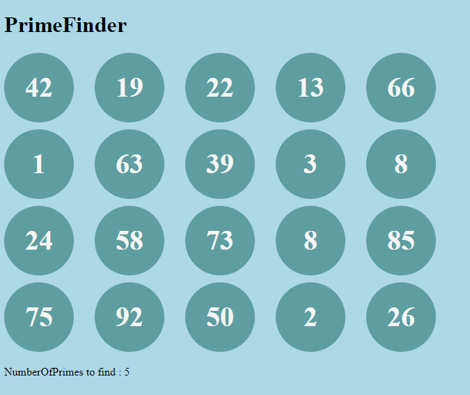
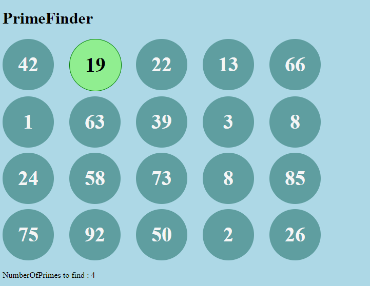
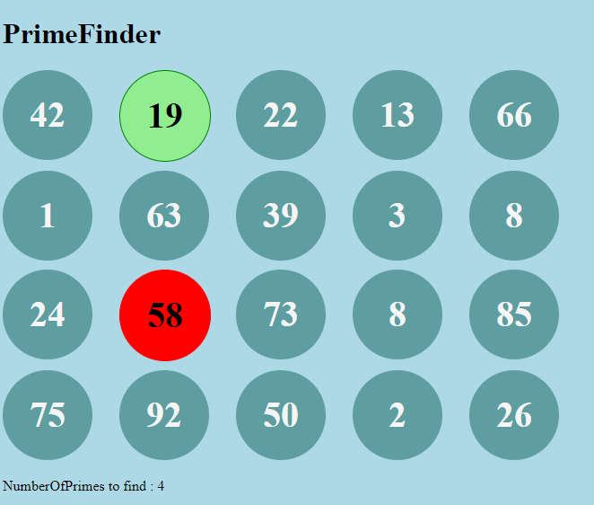
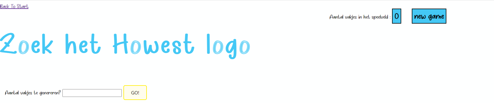
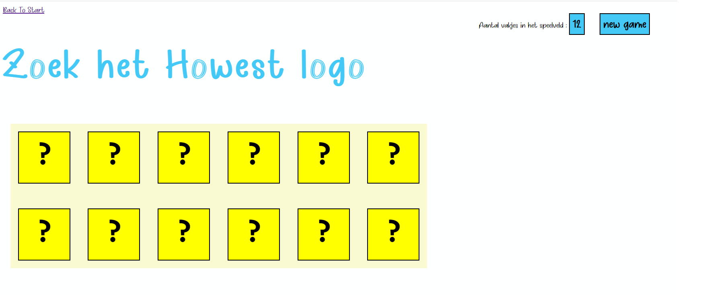
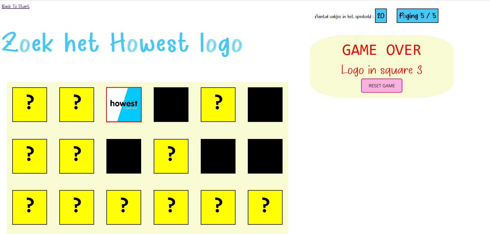
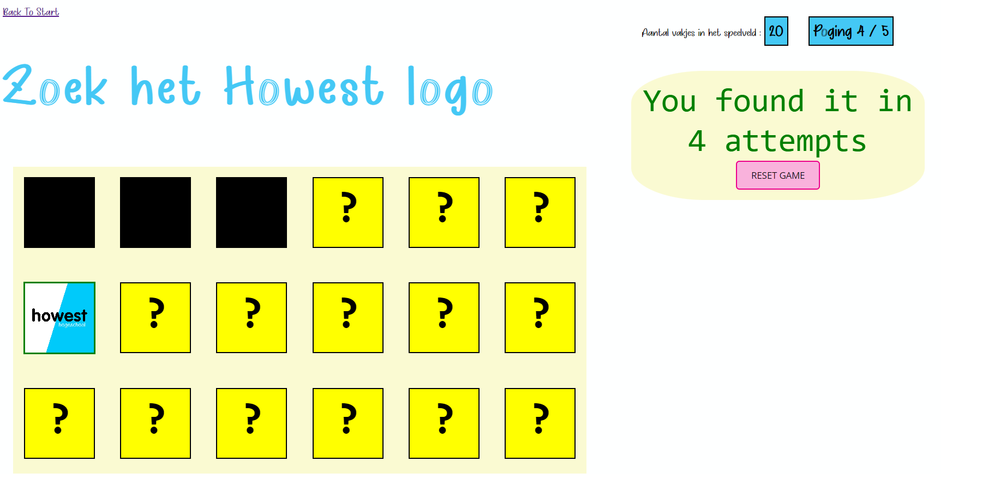

# PE01-PrimeFinder-LogoFinder-start
# Algemeen
Maak een applicatie waarbij je vanaf de indexpagina kan navigeren naar 2 pagina's.
Op elke pagina vind je een uniek applicatie

* PrimeFinderApplicatie
* LogoFinderApplicatie

Wees creatief ein zorg voor een persoonlijke opmaak, zonder daarbij afbreuk te doen aan de gevraagde functialiteit. Maak eventueel gebruik van een bestaand css-framework zoals :

- [materialize css](https://materializecss.com/)
- [tailwind css](https://tailwindcss.com/)
- [Pico css](https://picocss.com/)
- ...

Voeg een index.html toe, en zorg verder voor een degelijke folderstructuur.

## Opdracht 1 : PrimeFinder
Maak een applicatie waarbij je een speelveld vult met exact 20 vakjes.
Deze vakjes bevatten getallen die **random** gekozen worden tussen 1 en 101.
De applicatie geeft via een duidelijk weergave weer hoeveel priemgetallen er in het speelveld zitten.

### Functionaliteiten
Wanneer een gebruik een vak aanklikt wordt weergegeven aan de hand van opmaak of het getal al dan niet een priemgetal is :
- Indien priemgetal voorzie een lichtgroene achtergrond met een groene rand
- Indien geen priemgetal voorzie een rode achtergrond donkerrode rand

De gebruiker kan volgen of alle priemgetallen zijn geselecteerd, dit omdat de weergave van de priemgetallen wordt aangepast wanneer er een priemgetal is geselecteerd.

**Aandacht :** 
Let erop dat reeds aangeduide getallen niet meer aanklikbaar zijn.

### Screens PrimeFinder
**Startsituatie**



**Goed geraden**



**Fout geraden**




## Opdracht 2 : LogoFinder
Maak een applicatie waarbij je een speelveld vult met een **door de gebruiker** opgegeven aantal vakjes. Doe de nodige controles op de input in javascript, zodat dit een positief geheel getal is kleiner dan 20. Zorg voor een passend weergave van de foutmelding indien dit niet het geval is. 

Achter 1 willeurig (random) vak zit het HowestLogo verstopt. 

De gebruiker heeft **5** pogingen in het spel. Zorg dat de poging zichtbaar is in breukvorm (bv. poging 1/5).

Bij klikken op een speelvak, verbruik je een poging. De achterkant van het speelvak wordt zichtbaar. Zorg ervoor dat dit vak niet meer aanklikbaar is. Je controleert of het Howest logo in dit vak staat, indien dit het geval is, is het spel voorbij. 

Toon passende meldingen indien:
- het logo **gevonden** is binnen het aantal pogingen
- het logo **niet gevonden** is binnen het aantal pogingen

Indien het logo niet gevonden is binnen het aantal pogingen, onthul je waar het logo zat.

Wanneer het logo werd gevonden voorzie je dit vak van een **groene** rand. Indien het niet gevonden werd voorzie je het vak van het logo van een **rode** rand.

Bij het tonen van de feedback verschijnt op het einde van het spel een **reset** knop. Bij klikken op deze knop
worden alle waarden gereset en kan het spel opnieuw starten.

### Screens LogoFinder
**Startsituatie**

**Na aantal ingevuld**

**Niet geraden**

**Geraden**

**Na reset**


## TIP
Structuur je code goed door gebruik te maken van events en functions. Maak verschil tussen globale variabelen en lokale variabelen.

Om een random getal te genereren gebruik je de volgende code:
```javascript
//Genereert een getal van 1 tot 100
let random = Math.floor(Math.random() * 100) + 1;
```
